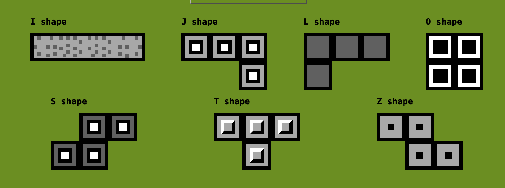

# CSS Tetrominoes

[Live demo](https://comatory.github.io/css-tetrominoes/)

You can use provided stylesheet to construct tetris pieces by using only CSS classes.

Look into `index.html` to see how you can construct pieces, my implementation is using `<table>` elements but they could be whatever.

No Javascript is required, the provided script is only used for the demo page.

## Development

Modify code in `src/` and run `make` to produce documentation output.
